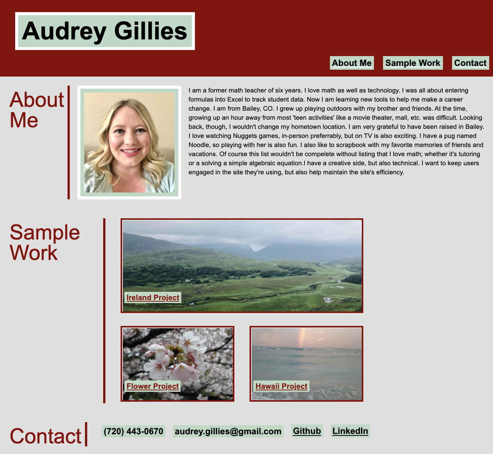

# Audrey Gillies' Portfolio

## Description

My portfolio is used to promote information about myself and my work to anyone who views it, such as potential new employers. I have included navigation links in the top section, links to projects I have made, and contact information. I worked on cleaning up my css file and omitting unnecessary classes. I practiced with pseudo classes as well as media queries.

## Assets

The following image is a screenshot of my html file loaded in a browser.

## Link to Live Url

Click below to open the actual link.

[My Live Website](https://audrey-g37.github.io/Audrey-Portfolio/)
